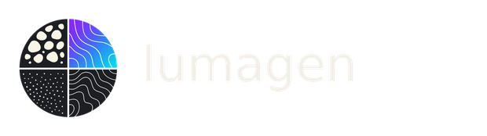
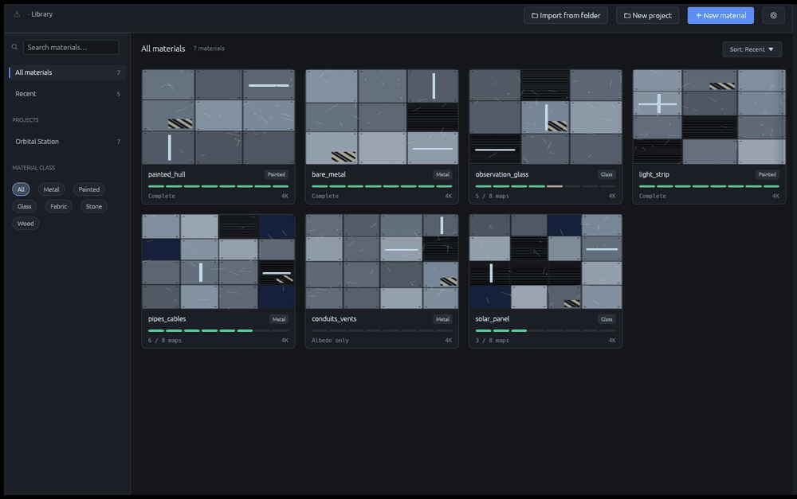
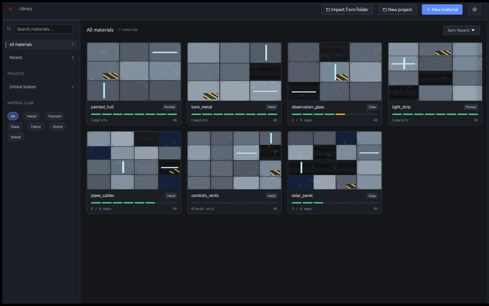
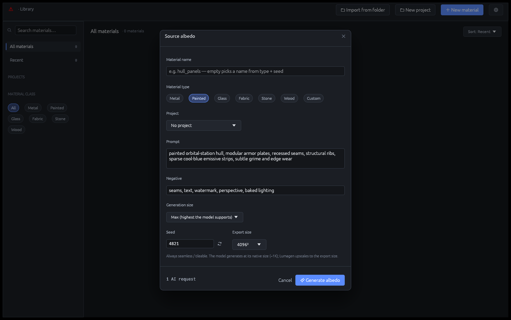
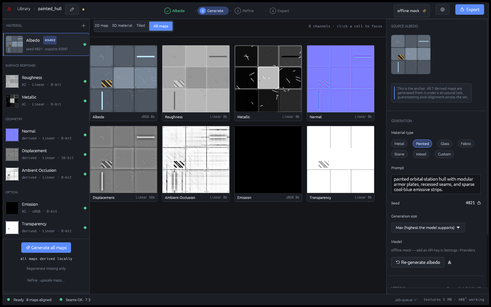
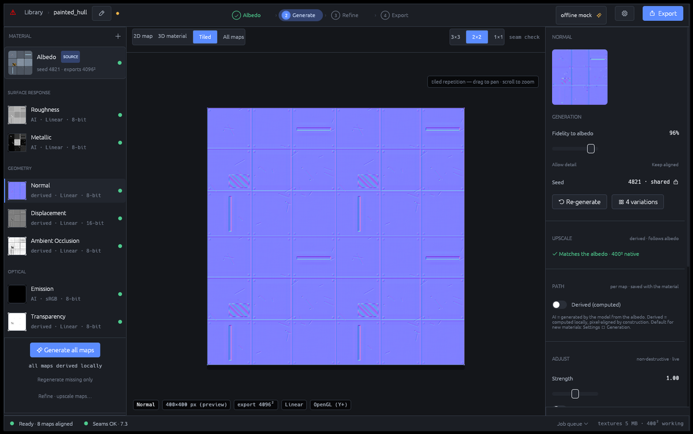
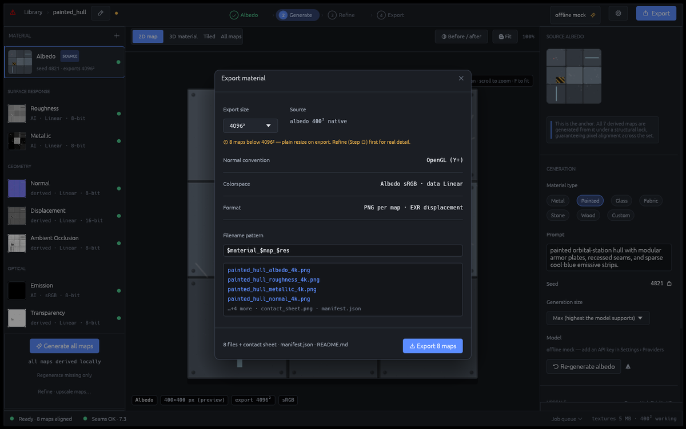

<div align="center">

<picture>
  <source media="(prefers-color-scheme: dark)" srcset="assets/wordmark-dark.png">
  <source media="(prefers-color-scheme: light)" srcset="assets/wordmark-light.png">
  
</picture>

### AI material studio for seamless, engine-ready PBR textures

Describe a material — Lumagen generates a seamless albedo and derives the
**full, pixel-aligned PBR map set**, ready to drop straight into your engine.




</div>

## What is Lumagen?

Lumagen is a desktop app for 3D and game artists who need **complete, tileable
PBR materials** without hand-assembling eight separate texture maps.

Type a description (or bring your own albedo) and Lumagen gives you a full
material — albedo, roughness, metallic, normal, displacement, ambient occlusion,
emission, and transparency — with **every map pixel-aligned to the albedo** and
exported in the layout your engine expects. It runs **fully offline out of the
box**; plug in a provider key when you want AI-generated albedos.

## Download

Lumagen is **Windows-only for now** (macOS and Linux are on the roadmap). Grab
the latest build from the
[**Releases page**](https://github.com/pixhaus-app/lumagen/releases/latest):

- **Installer (recommended)** — download `lumagen-<version>-x86_64-windows.msi`,
  double-click, and follow the prompts. It installs Lumagen with a Start-Menu
  entry, and a newer MSI upgrades an existing install in place.
- **Portable** — download `lumagen-<version>-x86_64-windows-portable.zip`, unzip
  anywhere, and run `lumagen.exe`. Nothing is installed or written outside the
  folder.

The binaries aren't code-signed yet, so Windows SmartScreen may warn on first
launch — choose **More info → Run anyway**.

<details>
<summary><b>Verify your download (optional)</b></summary>

Every release artifact carries signed [SLSA build provenance](https://slsa.dev).
With the [GitHub CLI](https://cli.github.com), confirm a file was built by
Lumagen's own release workflow from a tagged commit — and not tampered with:

```sh
gh attestation verify lumagen-0.1.0-x86_64-windows.msi --repo pixhaus-app/lumagen
```

</details>

## Why artists use it

- **One description → a whole material.** No more sourcing or authoring eight
  maps by hand for every surface.
- **Everything lines up.** The geometry maps (normal, displacement, AO,
  opacity) are *computed* from the albedo, so they are pixel-perfect aligned and
  seam-safe — never the misregistered mess you get from generating each map
  independently.
- **Seamless by default.** Output is tileable, with a built-in 2×2 / 3×3 seam
  check so you can verify before you ship.
- **Works with no account.** The offline mock engine runs the entire pipeline
  with zero API key and zero network — perfect for trying the whole flow.
- **Exports the way your engine wants.** Per-map PNG + 16-bit/EXR displacement,
  ORM / mask-map channel packing, OpenGL ↔ DirectX normal flip, your own
  filename pattern, plus a contact sheet and `manifest.json`.
- **Non-destructive refine.** Tune detail and fidelity live, re-roll variations,
  and upscale — without rebuilding the set.

## How it works

### 1 · Organize your materials



Your library groups materials by project, with at-a-glance **coverage pips** —
how many of the eight maps each material has — and target resolution. Point
Lumagen at a folder of loose maps and it groups them into a material for you.

### 2 · Describe the material



Start from a text prompt and a **material type** (metal, painted, glass, fabric,
stone, wood, or custom). Add a negative prompt, pick a seed, and choose the
export size. Whatever you generate is always seamless and tileable.

### 3 · Generate the full map set



From a single source albedo, Lumagen produces **all eight channels at once**:
the semantic maps (roughness, metallic, emission) come from your provider, while
the geometry maps are computed locally so they stay perfectly registered to the
albedo.

### 4 · Refine and check seams



Tile the preview **2×2 or 3×3** to confirm the material is seamless. Dial in
fidelity-to-albedo and detail per map, re-generate, or branch off variations —
all non-destructive and live.

### 5 · Export engine-ready



Choose the engine preset and export: per-map PNGs, a 16-bit or 32-bit-float EXR
displacement, a contact sheet, and a `manifest.json` — all named by your own
pattern (`$material_$map_$res`).

## The map set

Lumagen treats one map as the anchor and keeps the rest aligned to it:

| Map | Role | How it's produced |
| --- | --- | --- |
| **Albedo** | Base color — the anchor | AI-generated or imported |
| **Roughness** | Surface response | AI-generated |
| **Metallic** | Surface response | AI-generated |
| **Normal** | Geometry | Computed from the albedo |
| **Displacement** | Geometry (height) | Computed |
| **Ambient Occlusion** | Geometry | Computed |
| **Emission** | Optical | AI-generated |
| **Transparency** | Optical (opacity) | Computed |

Because the geometry maps are derived rather than generated, they line up with
the albedo by construction — no VAE drift, no network round-trip, and instant.

## Providers

Lumagen ships with three backends:

- **Offline mock** *(default)* — runs the full pipeline procedurally with no key
  and no network.
- **[fal.ai](https://fal.ai)** — the default AI backend, with first-class access
  to control/edit models (FLUX Kontext, Qwen-Image-Edit) that keep maps aligned.
- **[OpenRouter](https://openrouter.ai)** — image generation over chat
  completions.

API keys are stored in your **operating system's credential vault** (Windows
Credential Manager, macOS Keychain, or libsecret) — never written to disk in
app settings or config files. Add a key any time under **Settings → Providers**;
until you do, Lumagen simply uses the offline engine.

## Build from source

Prefer to build it yourself? With a [Rust toolchain](https://rustup.rs) installed
(the pinned version in `rust-toolchain.toml`, edition 2024):

```sh
cargo run --release
```

The release artifacts (portable zip + MSI installer) are produced by the
`Release` GitHub Actions workflow on a version tag — see
[`.github/workflows/release.yml`](.github/workflows/release.yml).

## License

Released under the [MIT License](LICENSE-MIT).
